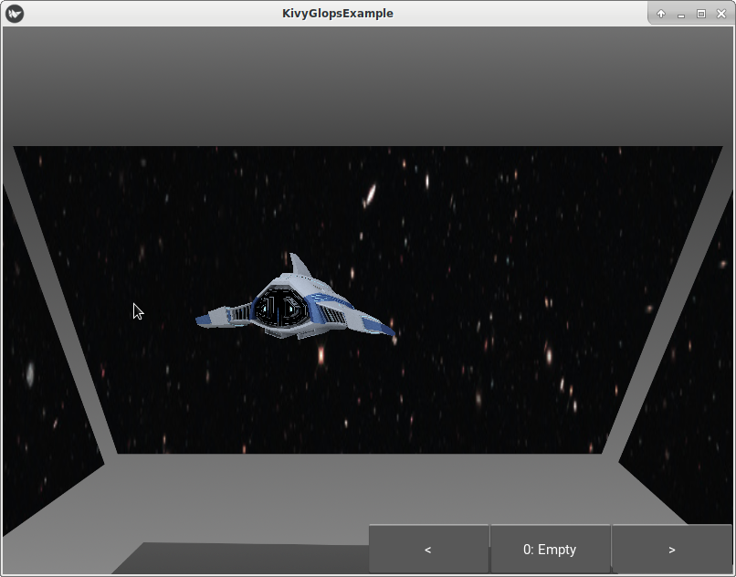

# KivyGlops
<https://github.com/poikilos/KivyGlops>

Control 3D objects and the camera in your 3D Kivy app!

The operating principle of this project is to focus on completeness.
This does not mean that the engine is completely opinionated, but
rather that the API is comprehensive enough to make various types of
games. The project will try not to limit the programmer, but also
provide ways to create games that are not boring to code. This means
that things will work before they work well.

For example:
- Walkmeshes should work before they work with physics.
- Physics should work before they use an external library.
- Shaders should shade objects with or without textures
  and before they shade objects with physically-based lighting.
- Movement should work before bones and other mesh animations work.
- Meshes should import in a fault-tolerant way before more formats are supported.

(See also [Issues](https://github.com/poikilos/KivyGlops/issues))

Because of following this principle, all of those things
have worked for a long time even though they are under heavy
development. Another benefit of this approach is that you can create
your project based on kivyglopsexampleblank.py (save it as a different
py file in same folder) then upgrade all of the other files with a new
version of KivyGlops and your project will increase in quality, but
your project will not have been limited in quantity (scope) by adopting
KivyGlops early. I hope that this software inspires you to create more
complete publicly-licensed code projects, whether using KivyGlops or
just learning from its OpenGL and GLSL code.



## Key Features
- Move and rotate 3D Objects separately
  ([Tutorials](https://expertmultimedia.com/usingpython/py3) demonstrate
  movement and rotation, and scaling is available).
- Move and rotate the camera separately from objects.
- Load each object (even if in same OBJ file) separately and in a format
  readily usable by Kivy (Load OBJ files into an intermediate format:
  KivyGlop)
  - The KivyGlop format (and PyGlop for non-Kivy uses) as a metaformat
    that is OpenGL-ready, and can import OBJ files and potentially others.
* KivyGlops tutorials are available for download at
  [expertmultimedia.com/usingpython](https://expertmultimedia.com/usingpython/py3/)
  (Unit 4 OpenGL)
* The engine itself triangulates (tesselates) OBJ files to meet the
  requirement of triangles (to avoid holes present when loading some
  models in other 3D Kivy examples).


## Usage:
- Lessons are available at
  [expertmultimedia.com/usingpython](http://www.expertmultimedia.com/usingpython)
  (click "Python 3," "Tutorials," "Start Learning Now," "Unit 2
  (OpenGL)") "Unit 2" will be used to refer Unit 2 of this site in this
  document.
- spec for actor_dict:
  - actor_dict is a dictionary that can contain custom variables such as
    actor_dict['hp']
  - actor_dict sent to set_as_actor_at will be copied (by
    self.deepcopy_with_my_type [which allows deepcopy of glops within a
    dict], not by reference), so you can change it later for making
    similar actors without any problems
  - actor_dict will be filled in with required variables when you call
    set_as_actor_at, but the method will overlay your variables over
    the defaults, except for builtins with runtime info such as the
    `actor_dict['state']` dict which should be left alone.
  - if you want ai, you must set actor_dict["ai_enable"] = True
    - if you enable ai, the on_process_ai event will occur every frame
      before ai variables are checked (but the AI won't do anything
      unless you set the actor_dict variables during on_process_ai; see
      the AI section below)
      - See also "Unit 2" lesson 7
  - clip_enable can be in actor dict: it and any other keys that are in
    `self.settings['templates']['actor_properties']` will be moved to
    `properties`
- spec for item_dict:
  - 'uses' is a list containing use strings as follows:
    - uses like "throw_linear" or 'throw_arc' or "shoot_linear" causes the item to be thrown
      - if "throw_" is in the use entry, player's ranges will be used (for example, if you set item_dict["throw_custom"], also set unit_glop.actor_dict['ranges']["throw_custom"] (if already set as actor, you don't need to do actor_dict['ranges'] = {} for it will already exist as a dict)
      - if "shoot_" is in the use entry, item's ranges will be used (for example, if you set item_dict["shoot_custom"], also set item_dict['ranges']={} then item_dict['ranges']["shoot_custom"])
      - NOTE: though the units where actor_dict["ai_enable"] is True will attack from that range, physics will determine whether the projectile reaches its target
  - 'drop_enable': (True or False, or string like "yes", "no", etc) whether weapon leaves your inventory as soon as you use it (yes for rocks...hopefully you get the idea); considered True if not present
    - special variables used along with drop_enable False:
      'fired_sprite_size': tuple containing 2 floats (example: ` = (0.5, 0.5)`) in meters determining size of sprite in 3D space
      'fired_sprite_path': path to sprite (image will be placed on an automatically-generated square)
  - 'projectile_keys': a list of variables that will be copied to the projectile (if projectile hits, projectile_dict will not be None, and will contain your variables whose keys you listed, when on_attacked_glop occurs)
  - generated members:
    'fires_glops': list of glops that will be fired (generated automatically if you use add_actor_weapon and have fired_sprite_path)
* attack_uses is a list of strings and can be accessed or changed from within your implementation of KivyGlops using self.settings['globals']['attack_uses'] (first ones in list will be preferred by actors where `actor_dict["ai_enable"]` is true)
* fit_enable entry in item_event dict returned by push_item denotes whether giving an item to the player was possible (false if inventory was full on games with limited inventory)
* if you get a stack overflow, maybe one of the dict objects you put on an object contains a reference to the same object then copy or deepcopy_with_my_type was called
* each program you make should be a subclass of KivyGlops or other PyGlops subclass (if you subclass PyGlops for framework you are using other than Kivy, your *Glops class should have all methods that KivyGlops has since PyGlops expects self to have implemented methods such as load_obj)
* pyrealtime module (which does not require Kivy) keeps track of keyboard state, allowing getting keystate asynchronously
* To modify any files (other than examples or tests) see "Developer Notes" section of this file for more information.
* this_glop.state is for data which should be in saved state such as game save but not in exported object--also you can use item_dict['state'] or actor_dict['state']; use properties or item_dict or actor_dict directly for permanent data.
* any glop where glop.actor_dict is not None will be treated as an actor, so use set_as_actor_at instead of creating it yourself, so that the necessary variables will be set for proper engine function.
* implement attacked_glop_at for unit-targeting attacks
* implement on_at_rest for whenever items stop being affected by physics (such as for area of effect items such as launched missiles)
    * NOTE: if a player is hit by the missile, attacked_glop_at will also be called by the engine
* implement on_update_glops to do stuff every frame, after ai (and remote players in future version) occurs but before physics and constraints are calculated
    * For example, if you want a sports game, normally if you get hit by a projectile you don't obtain it (move away and come back and if it is still there, then you can obtain it)--this is realistic since if you got a rock thrown at you and it hits you, you probably won't catch it; maybe some way of overriding this could be implemented for a sports game with a ball, otherwise you can just only allow catching it before it hits you (you could try to catch it in on_update_glops--set projectile_dict to None so it _internal_bump_glop doesn't block obtaining it)
* to add values to debug screen (F3 to view):
    * to simply add a value, manipulate the global debug dict such as `debug_dict["time"] = "12:00pm"`
    * if you want to format a tuple, you could do `debug_dict["boss.pos"] = fixed_width(boss.pos, 4, " ")`
    * if you want a new category, make a new dict in debug_dict such as `debug_dict["earth"] = {}` then set your values such as `debug_dict["earth"]["water"] = 71.`
* to change defaults for properties, actor_dict, and item_dict, see `settings['templates']`
    * settings guarantees certain values needed by the engine (like a class, but more "functional" and easier to automatically load and save only the relevant values in human-readable format), so avoid deleting any dicts or values or setting anything to None in the defaults of `settings` or `settings['templates']` unless you have subclassed PyGlops in a way that you know you don't need the values

### AI
* If you implement the KivyGlops on_process_ai method, you shouldn't move anything otherwise glitches will almost certainly occur. This is not a limitation of the engine--it is a recommendation to be logical, so that you ensure your visuals presented to the player make sense.
  * Things that you can safely do in on_process_ai include:
    * cause glop that is an actor to use items (via the use_item_at method of a glop)
    * set indices and strings that will be used to control the character, such as values at the following keys in glop's actor_dict: 'moveto_index', 'target_index' which refer to objects in the self.glops list
  * Things that are not so great but still work:
    * set a non-ai variable in an actor_dict (such as, modify health--which should probably be done in on_at_rest or attacked_glop_at)
  * NOTE: after on_process_ai is called, the `actor_dict['target_index']` will be set to None if the item doesn't have any item where any of the item's uses are in attack_uses, unless you set `actor_dict['unarmed_melee_enable'] = True`

### Teaching using KivyGlops:
* update-kivyglops from LAN.bat will only work for students if teacher places KivyGlops in R:\Classes\ComputerProgramming\Examples\KivyGlops
(which can be done using deploy.bat, if the folder already exists and the teacher has write permissions to the folder; the students should have read permissions to the folder)
* if segfault occurs, maybe camera and look_at location are same

## Changes
See [Changelog](changelog.md)


## Known Issues
* only set glop's glop_index and glop's state['glop_index'] in add_glop, nowhere else
* add pathing for processing `actor_dict['target_pos']` (even if not ai_enable, in case of strategy game where target_pos is set on a player-controlled glop)
* implement seperable_offsets for explosions
* eliminate foot_reach in favor of using hitbox
* did not test air-move or double-jump in on_update_glops
* eliminate look_target_glop in favor of a relationship in 'links'
* upload updated version of lessons to website mentioned in Usage section (in the meantime see testing.py for updated code, or see Changes section for anything that says "renamed" or "required")
* pyglops.py: remove kivy-specific _translate_instruction_* (in throw cases)
* projectile_speed of `item_dict` or of `item_dict['as_projectile']` should override throw_speed of actor ONLY if present
* allow rocks to roll (and keep projectile_dict until they stop) in opengl9
* pyglops.py: (_internal_bump_glop; may not be an issue) plays `properties['bump_sound_paths']` for both bumper (actor) and bumpable (item)
* pyglops.py: eliminate item_dict['fire_type'] dict (may contain "throw_linear" key) and merge with item_dict['uses'] (test with opengl6 or opengl7 since they use a weapon dict that is NOT a glop (only has fired_glop)--they may need to be changed)
* pyglops.py: eliminate (or improve & rename) index_of_mesh, select_mesh_at
* see `failed to deepcopy` -- not sure why happens
* by default do not set bounds; modify instructions on expertmultimedia.com to set bounds for office hallway project
* make a file-reading kernel for loading obj files to avoid blocking io
* this is a pending change (may not be changed ever) #instructions should be changed from `item_dict['use'] = 'throw_arc'` to:
  `item_dict['uses'] = ['throw_arc']`
  see example-stadium for more info
* pyglops.py (PyGlops __init__): implement _player_indices (already a list)
* fix nonworking ishadereditor.py (finish 3D version)
* pivot_to_g_enable is broken (must be left at default True): (defaults for pivot_to_g_enable are flipped since broken) pyglops.py: (append_wobject) make self.transform_pivot_to_geometry() optional, for optimization and predictability (added to set_as_item where pivot_to_g_enable; also added that option, to set_as_item, load_obj, get_glop_list_from_obj, append_wobject)
* renamed etc/kivyglops-mini-deprecated.py to testingkivy3d.py and MinimalKivyGlopsWindow class in it to TestingKivy3D
* see `context.add(this_glop._color_instruction)  # TODO: asdf add with set_uniform instead`
* Only load unique textures once (see "Loaded texture")
* if object has upward momentum, shouldn't stick to ground (is set near ground if player is near ground during `def use_selected`)
* pyglops.py: (`update`) throw_linear vs throw_arc setting is ignored (instead, gravity is always applied to missile if _cached_floor_y is present, which is present if there is a walkmesh, in which case ground_y is calculated then object's _cached_floor_y is set to ground_y)
* add touch inventory (such as tap to use, drag to change selected item)
* add touch joystick (drag to tilt joystick to dolly or strafe--optionally start at "forward" position)
* cache heightmap for each walkmesh as y-buffer (y is up; load from cache instead of recomputing if date >= source mesh file)
    * If was 64-bit (8bytes per fragment) 8 * 8192 * 8192 /1024/1024 = 512 MB
    * If was 32-bit (4bytes per fragment) 4 * 8192 * 8192 /1024/1024 = 256 MB
    * If was 16-bit (2bytes per fragment) 2 * 8192 * 8192 /1024/1024 = 128 MB
    * If was 16-bit (2bytes per fragment) 2 * 4096 * 4096 /1024/1024 = 32 MB
    * (as an unrelated performance comparison, an alpha lookup table is 256*256*256 /1024/1024 = 16 MB)
* fired sprite should stay facing camera (as add_actor_weapon sets look_target_glop)
* deal with situation-dependent members when saving glop:
    * `look_target_glop` which is a reference and for that reason copied by ref
    * `weapon_dict['fires_glops']` which may be runtime-generated mesh such as texture on square mesh (or "meshes/sprite-square.obj")
* Add the following code to expertmultimedia.com boundary detection lesson since was removed from KivyGlops __init__ (or add after call to on_update_glops??):
  ```This is done axis by axis--the only reason is so that you can do OpenGL boundary detection lesson from expertmultimedia.com starting with this file
    if self.world_boundary_min[0] is not None:
        if self.player_glop._t_ins.x < self.world_boundary_min[0]:
            self.player_glop._t_ins.x = self.world_boundary_min[0]
    if self.world_boundary_min[1] is not None:
        if self.player_glop._t_ins.y < self.world_boundary_min[1]: # this is done only for this axis, just so that you can do OpenGL 6 lesson using this file (boundary detection)
            self.player_glop._t_ins.y = self.world_boundary_min[1]
    if self.world_boundary_min[2] is not None:
        if self.player_glop._t_ins.z < self.world_boundary_min[2]: # this is done only for this axis, just so that you can do OpenGL 6 lesson using this file (boundary detection)
            self.player_glop._t_ins.z = self.world_boundary_min[2]```
* eventually remove projectiles (though pop method of list takes from left, change _bumpable_indices to a deque for better pop performance):
  ```
  from collections import deque
  >>> l = deque(['a', 'b', 'c', 'd'])
  >>> l.popleft()```
* resource license: compatibility should be checked against original resource licenses
* vertex normals should supercede smoothing groups (which are based on faces) according to the obj format spec [1], but I'm not sure why since that would accomplish nothing since normals are blended across faces on OpenGL ES 2+
* implement vendor-specific commands at end of OBJ file (see wobjfile.py vs "Vendor specific alterations" section of <https://en.wikipedia.org/wiki/Wavefront_.obj_file>)
* implement Clara.io PBR extensions to OBJ format (see wobjfile.py vs "Physically-based Rendering" section of <https://en.wikipedia.org/wiki/Wavefront_.obj_file>)
* `texcoord_number` is always None during `this_face.append([vertex_number,texcoord_number,normal_number])` in wobjfile.py; see also stated_texcoord_number from which texcoord_number is derived when stated_texcoord_number is good
* fix issues introduced by refactoring:
        * throw_arc has no gravity
        * walkmesh is ignored
        * cylinder map doesn't work (is loaded at bottom left under 3D scene?)
* Music loop option is not actually handled
* move event handlers and any other methods starting with underscore from kivyglops.py to pyglops.py where possible
    * moved from KivyGlopsWindow to PyGlops [new ones in brackets]:
        * _internal_bump_glop, after_selected_item, add_actor_weapon, get_player_glop_index
        * [give_item_by_keyword_to_player_number, give_item_index_to_player_number,_run_command, _run_semicolon_separated_commands, _run_commands, _run_command]
    * copied to KivyGlops and PyGlops, leaving KivyGlopsWindow methods that call them: hide_glop
        * already done: set_fly [later refactored into set_player_fly]
* push_glop_item should create usable parent-child relationship for movement (at least for selected_item or costume accessories--there is no need to move inventory objects until they are visibly selected/held); or move item to the glop's canvas to accomplish that automatically
* pyglops: get_player_glop_index(player_number) should distinguish between multiple players (instead of ignoring param and using get_player_glop_index then falling through to which `is player_glop`)
* should behave as though you have 1 crate when you have 1 (instead of when you have 2)
* application crash during play_music internal methods if file does not exist
* should get self.scene.glops[bumped_index]._cached_floor_y from walkmesh underneath instead of self.scene._world_min_y
* should only place unique points into glop when individuating objects in o file
* fix glitch where walking into corner fights between walls (resolve by getting better pushed_angle that moves in same direction as walking instead of same direction as pushed back by boundary)
* Implement lighting by improving shader (instead of only flat shading of textured objects being available)
* Calculate rotation on other axes before calling look_at (only does y rotation currently, using a&d keys)
* Does not load map types from mtl that do not start with "map_":
  ```python
    _map_bump_filename = None  # map_bump or bump: use luminance
    _map_displacement = None  # disp
    _map_decal = None # decal: stencil; defaults to 'matte' channel of image
    _map_reflection = None  # refl; can be -type sphere
```
* cylindrical-mapped backgrounds should be pi-ratio so they don't repeat (such as 3142 x 1000) since the engine refuses to stretch them (by design)


## Planned Features
* support surf and mg commands in OBJ
* show selected item in hand
* Use Z Buffer as parameter for effects such as desaturate by inverse normalized Z Buffer value so far away objects are less saturated1
* Implement thorough gamma correction (convert textures to linear space, then convert output back to sRGB) such as http://www.panda3d.org/blog/the-new-opengl-features-in-panda3d-1-9/
* Implement standard shader inputs and Nodes (see Blender as a reference)
  * allow Mix nodes
  * allow dot of Normal to be used as a Factor, such as for putting the result into an Mix node with black and white (or black and a color), where the result is sent to a Mix node set to Add (to create a colored fringe)
* Implement different shaders for different objects (such as by changing shader.vs and shader.fs to different vertex shader and fragment shader code after PopMatrix?)
    (It can be done by subclassing Widget and setting self.vs and self.fs such as in C:\Kivy-1.8.0-py3.3-win32\kivy\examples\shader\plasma.py)
* Implement spherical background map
* Implement Image-Based Lighting (simply blur global background for basic effect)
* Implement fresnel_away_color fresnel_toward_color (can have alpha, and can be used for fake SSS)
* Implement full-screen shaders
* Add a plasma effect to example (such as using plasma shader from C:\Kivy-1.8.0-py3.3-win32\kivy\examples\shader\plasma.py)
  - Note that the following uniforms would need to be added for that example:
    ```python
        self.canvas['time'] = Clock.get_boottime()
        self.canvas['resolution'] = list(map(float, self.size))
```


## License
See [license.txt](license.txt).

### Authors
Software is copyright Jake Gustafson with the following exceptions:
* KivyGlops object loading and opengl code was derived from
  [kivy-trackball](https://github.com/nskrypnik/kivy-trackball) (no
  license).
* The material loader was derived from
  [kivy-rotation3d](https://github.com/nskrypnik/kivy-rotation3d) (no
  license).
* kivy-rotation3d was presumably derived from main.py, objloader.py and
  simple.glsl in Kivy, approximately version 1.7.2 (originally MIT
  license).

Resources are provided under Creative Commons Attribution Share-Alike
([CC BY-SA 4.0](http://creativecommons.org/licenses/by-sa/4.0/))
license.

#### With the following caveats:
* testnurbs-all-textured.obj was derived from testnurbs by nskrypnik


## Developer Notes
See [contributing.md](contributing.md).
